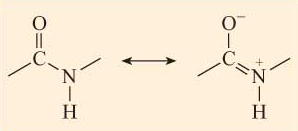
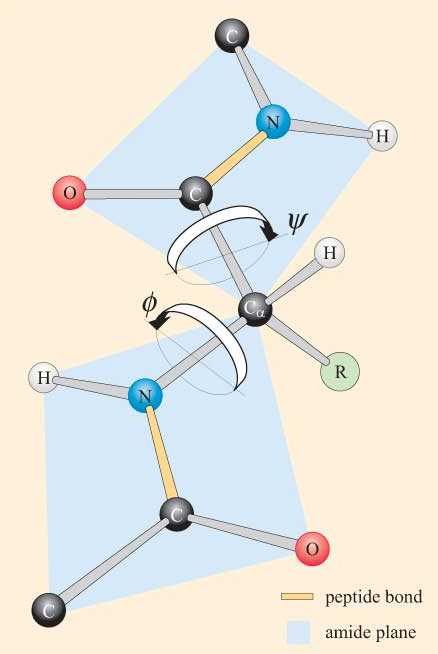
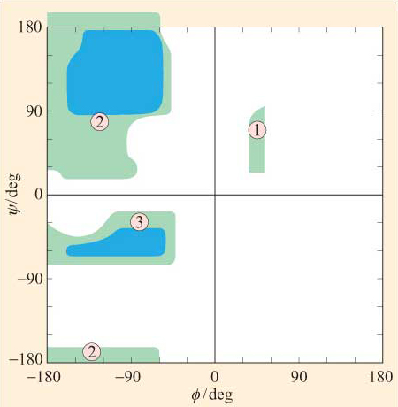

# Ramachandran

[](https://travis-ci.com/simonholmes001/amino_acid_feature_extraction)
[](https://amino-acid-feature-extraction.readthedocs.io/en/latest/?badge=latest)
[](https://scrutinizer-ci.com/g/simonholmes001/amino_acid_feature_extraction/?branch=master)
[](https://scrutinizer-ci.com/g/simonholmes001/amino_acid_feature_extraction/build-status/master)
[](https://scrutinizer-ci.com/code-intelligence)
[](https://pypi.python.org/pypi/sphinx_rtd_theme/)

* MIT license

# Contents

- [To Do](#todo)
- [Objectives](#objectives)
- [Data Sources & Collection](#data)
- [Requirements & Pre-Requisites](#requirements)
- [Background Information](#info)
- [Set-up & Usage](#set_up)
- [Further Background Elements](#background)

## <a name="todo"></a> To Do

-[x] Finish README

-[ ] Update badges

-[ ] Correct phi & pis angles to be in the range [-pi, pi]

-[ ] Write scripts for statistical analysis of the phi & psi angles of the PDB collection

-[x] Unit tests

-[ ] Packaging of project to conda

-[ ] Packaging of project to pypi

-[ ] Packaging of project to docker

-[ ] Write script to draw Ramachandran plots for each amino acid

## <a name="objectives"></a> Objectives

This project aims to analyse the statistical distribution of dihedral angles for each of the amino acids present in the
protein entries of the **Protein Data Bank** [PDB](https://www.rcsb.org) (database downloaded as of Jan 2020; conditions as of January 2020).

The project is named after [G.N. Ramachandran FRS](https://en.wikipedia.org/wiki/G._N._Ramachandran), who developed the Ramachandran Plot to analyse the distribution of torsion
angles in protein structures.

## <a name="data"></a> Data Sources & Collection

This project uses data from the [Protein Data Base](https://www.rcsb.org/). To download the entire PDB, the following script
should be run from the command line:

```bash
rsync -rlpt -v -z --delete --port=33444 \
rsync.rcsb.org::ftp_data/structures/divided/mmCIF/ ./mmCIF
```
Downloading the entire PDB data base will take approx 2 1/2 days & will require 43.94 GB of disk space.

Running these scripts will download a number of folders, with each folder containing a number of gzip files.
These files contain the experimentally determined 3D coordinate structures of various proteins. In addition to the x-, y-
& z-atomic coordinates, the files contain metadata explaining the experimental design, structural resolution, author information,
and a number of other items pertaining to the 3D structure determination. The files are in a `.cif` format (Crystallographic Information File).

A small sample of the PDB can be downloaded from [here](http://bit.ly/2Qv1seW).

## <a name="requirements"></a> Requirements & Pre-Requisites

This project was developed in python3.7. All other requirements are installed via the creation
of a conda virtual environment when the `create_database.sh` script is run.

Other pre-requisites include running the <a name="features"></a> [amino_acid_feature_extraction repo](https://github.com/simonholmes001/amino_acid_feature_extraction) (which
itselfs runs scrips from the [pubchem_api repo](https://github.com/simonholmes001/pubchem_api)) & the [protein_structure repo](https://github.com/simonholmes001/structure_prediction).

To run the [amino_acid_feature_extraction repo](https://github.com/simonholmes001/amino_acid_feature_extraction), run `git clone https://github.com/simonholmes001/amino_acid_feature_extraction.git`
from the command line, `cd` into the repo & run the command

 `bash -i feature_extraction.sh`

Running this command will generate a number of files in a folder called `output/`. The file called <a name="above"></a>`standardised_features.csv` should be copied to the
folder containing the [protein_structure repo](https://github.com/simonholmes001/structure_prediction), as per the instructions in the [README](https://github.com/simonholmes001/structure_prediction/blob/master/README.md).

To run the [protein_structure repo](https://github.com/simonholmes001/structure_prediction), run `git clone https://github.com/simonholmes001/structure_prediction.git`
from the command line, `cd` into the repo & run the command

`bash -i create_datasets.sh [YOUR_FOLDER_CONTAING_PDB_FILES] [NAME_OF_TEMPORARY_STORAGE_FOLDER]`

after following the instructions presented in the [README](https://github.com/simonholmes001/structure_prediction/blob/master/README.md) file.

The data required for this project are the `amino-acid-tag` files, located in the `structure_prediction/output/final_final_features/` folder (see [below](#below_1)).

## <a name="info"></a> Background Information

### Dihedral (Torsion) Angles

#### Reference material
See:
- https://byjus.com/maths/dihedral-angle/
- http://tutorial.math.lamar.edu/Classes/CalcIII/EqnsOfPlanes.aspx
- http://www.math24.net/plane
- http://www.maths.usyd.edu.au/u/MOW/vectors/vectors-13/v-13-2.html
- http://guweb2.gonzaga.edu/faculty/cronk/CHEM440pub/dihedral.html
- https://youtu.be/NSU0OnW9yLk

#### Definition

The angle formed between two planes that intersect is called a dihedral angle.
Formally, it is the angle formed between vectors that are normal to each plane.
And if we have two points that lie in the same plane, then the vector normal to that
plane can be calculated using the cross product between the two vectors. Subsequently,
the angle between two normal vectors can be calculated from the dot product of the two
normal vectors. This angle corresponds to the dihedral angle between the two planes.

#### Torsion angles in proteins

See: https://www.open.edu/openlearn/science-maths-technology/science/biology/proteins/content-section-1.2

Due to the delocalisation (resonance) of the lone pair of electrons on the nitrogen atom of the peptide bond,
peptide bonds display partial double bond character. This in turn, significantly restricts rotation around the
carboxyl carbon atom of amino acid N & the nitrogen atom of amino acid N+1, making the peptide bond essentially planar (see below).



In addition to restricting rotation, the partial double bond character of the peptide bond means that the alpha carbon, carboxyl carbon
of amino acid N & the nitrogen & alpha carbon atoms of amino acid N+1 lie in the same plane.

However, there is no restriction to rotation around the two bonds on either side of the peptide bond. Hence rotation can freely occur
around the nitrogen - alpha carbon bond & around the alpha carbon - carboxly carbon bond. These rotations hence rotate the planes
formed by the atoms & themselves give rise to dihedral or torsion angles for each amino acid.

Rotation around the nitrogen - alpha carbon bond is measured as the phi angle & rotation around the alpha carbon - carboxyl carbon
bond is measured as the psi angle.

Hence, the φ angle is computed between the normal to the plane made by three atoms Ci−1, Ni, and Cαi &
the normal to the plane made by the three atoms Ni, Cαi, and Ci.

The ψ angle is calculated between the normals made by the Ni, Cαi, Ci plane and the Cαi, Ci, Ni+1 plane.



Due to steric constraints of the amino acid side chains - amino acids are mostly found in the *trans* configuration - not all values of phi & psi are allowed.
As a result of these steric constraints, only certain values of ɸ and ψ, and hence conformations of the peptide, are permitted whilst others are not.

A conformational plot of ɸ against ψ for a particular residue or protein is known as a Ramachandran plot (after its inventor, G. N. Ramachandran).
The values of ɸ and ψ in a Ramachandran plot range, as per convention, from −180º to +180º.




## <a name="set_up"></a> Set-up & Usage

### Repo Set-Up

The repo should be downloaded by running `git clone https://github.com/simonholmes001/ramachandran.git`
in the command line. `cd` into the newly created `ramachandran`.

To initialise the project, this repo follows some of the sane steps as the [protein_structure repo](https://github.com/simonholmes001/structure_prediction).
The first step is to create a folder in the main repo that holds the data to be processed, containing the folders downloaded from the PDB.
This should give something that looks like this:
```
ramachandran
    |- data/
    |   |- folders containting pdb.cif.gz files
    |- ramachandran/
    |   |- scripts to run the project
    |- tests/
    |- create_datasets.sh
    |- environment.yml
    |- README.md
```

### Pre-Processing

To run the pre-processing phase of the project, `cd` into the repo and run the
following command from the terminal:

`bash -i create_datasets.sh [YOUR_FOLDER_CONTAING_PDB_FILES] [NAME_OF_TEMPORARY_STORAGE_FOLDER] [PATH_TO_THE_AMINO_ACID_TAGS]`

In this example, this would mean running the following command:

`bash -i create_datasets.sh data temporary_holding_file ../path_to_amino_acid_tags`

The `data` flag directs the script to look for the downloaded & unzipped PDB files in a folder called `data/`.

The `temporary_holding_file` flag indicates to the script a folder location to store data temporarily.

The <a name="below_1"></a> `path_to_aino_acid_tags` flag indicates to the scriopt the location of where you have saved the amino acid tags for the protein samples, generated
by running the [protein_structure repo](https://github.com/simonholmes001/structure_prediction).

Running this command will perform the following events:

- Create a conda virtual environment for the dependencies, based on the `environment.yml` file
- Unpacks the pdb.cif.gz files to pdb.cif files & stores the pdb.cif files in a temporary folder called `extracted_data/` (`unpack_pdb_files.sh`)
- Deletes the `data/` folder to tidy folder structure & remove no longer necessary files. If you want to keep a copy of the PDB downloaded data, it is highly recommended to do so elsewhere or on an external drive, as after the unpacking, the initial `data/` folder will get deleted to save space
- Extracts the x-, y-, z-atomic coordinate information from the pdb.cif files, for each atom of each amino acid (`extract_atomic_coordinate_info.sh`)
- Removes any empty files, such as DNA or RNA submissions (`remove_empty_files.sh`)
- Prepares a matrix of the atomic coordinates of the N, alpha-C, carbonyl-C atoms for the calculation of the dihedral angles (`create_dihedrral_matrix.py`)
- Prepares the data for phi and psi angle calculation & defines the methods to calculate the angles (`ramachandran.py`)
- Calculates the phi (`phi_angles.py`) & psi angles (`psi_angles>py`), in radians, for each residue for each protein, saving the outputs as pickle objects
- [TO DO] Prepares a statistical analysis, for each amino acid, of the distribution of phi & psi angles found in the collection of proteins found in the PDB

### Unit Testing

The repo was tested on PDB entry 1a11 & test data is available in the `/tests/` folder. Phi & psi angles were compared to angles from here: https://stackoverflow.com/questions/25355401/getting-all-dihedral-angles-in-pymol

## Statistical Analysis

## Packaging

### Conda

### Pypi

### Docker

## <a name="background"></a> Further Background Elements

The PDB curates the largest collection of experimentally determined 3D protein structures.

### Command line tools for downloading the protein data base (PDB) dataset

See:
- http://www.wwpdb.org/ftp/pdb-ftp-sites

To download coordinate files in PDB Exchange Format using the macromolecular Crystallographic Information File (mmCIF) run the following commands:


```bash

rsync -rlpt -v -z --delete --port=33444 \
rsync.rcsb.org::ftp_data/structures/divided/mmCIF/ ./mmCIF
```
Downloading the entire PDB data base will take approx 2 1/2 days & will require 43.94 GB of disk space.

### Data Items Describing Atomic Positions

See:
- http://mmcif.wwpdb.org/docs/tutorials/content/atomic-description.html

### Data Items Describing Molecular Entities

See:
- http://mmcif.wwpdb.org/docs/tutorials/content/molecular-entities.html

### Introduction to PDB Format

See:
- https://www.cgl.ucsf.edu/chimera/docs/UsersGuide/tutorials/pdbintro.html
